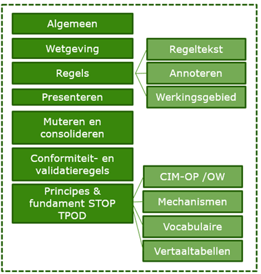

TPOD en praktijkrichtlijnen
---------------------------

Er is door KOOP één generieke standaard ontwikkeld voor alle
overheidspublicaties: de Standaard Officiële Overheids Publicaties, ofwel STOP.
De standaard legt vast hoe de regels moeten worden ingedeeld en geannoteerd, hoe
regeltekst aan locaties moet worden gekoppeld en welke waardelijsten van
toepassing zijn.

Middels het Toepassingsprofiel Omgevingsdocumenten (TPOD) wordt de STOP
verbijzonderd met specifieke toepassingen voor de Omgevingswet en de specifieke
OW-besluiten, hier OW-besluiten genoemd. De TPOD OW-besluiten zijn vooral
bedoeld voor de technische aspecten en toepassingen per OW-besluit. Deze bestaat
uit normatieve en toelichtende tekst.

Voor de praktische invulling ten behoeve van het opstellen van OW-besluiten zijn
de praktijkrichtlijnen in het leven geroepen. Hierin staat per type besluit
beschreven hoe de standaard toegepast kan worden. De praktijkrichtlijn bevat
toegankelijke inhoudelijke informatie over de standaard en specifiek over de
afzonderlijke TPOD’s. De praktijkrichtlijn gaat in op de rechtsfiguur, de
besluitdelen en inhoud per OW-besluit. Daarnaast gaat het in op de regeltekst,
annoteren en werkingsgebieden van het OW-besluit en STOP-principe over het
presenteren en muteren & consolideren.

De onderwerpen van de praktijkrichtlijnen zijn vastgelegd in de onderstaande
afbeelding.

Onderwerpen praktijkrichtlijnen 0.97

De praktijkrichtlijnen zijn nog volop in ontwikkeling. Indien uitgewerkte
casussen met praktijkvoorbeelden beschikbaar worden gesteld door het bevoegd
gezag, worden deze toegevoegd aan de praktijkrichtlijnen.

In deze praktijkrichtlijnen is ook is het verhaal over het huis van de
STOP-TPOD-standaarden opgenomen. Dit verhaal is een metafoor voor het opbouwen
van inzicht, overzicht en handelingsperspectief m.b.t. de standaard.

De metafoor spreekt over de hoofdelementen van een woning (de
STOP-TPOD-standaard) die samen de woning vormen.

Het dak van het huis van de standaarden: de praktijkrichtlijnen

De praktijkrichtlijnen behoren tot het dak van de woning.
