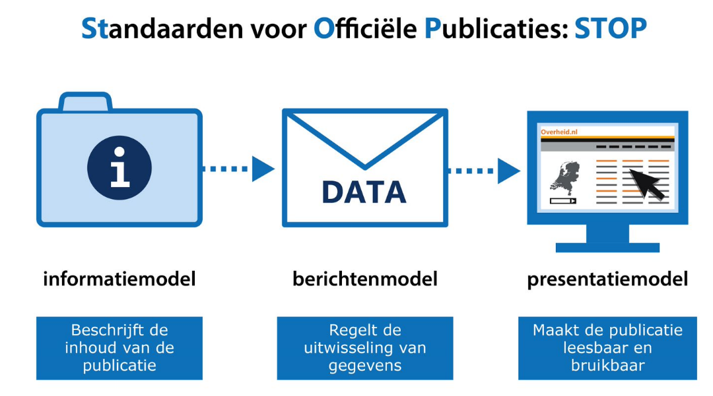

STOP voor je begint
-------------------

De algemene standaard zorgt ervoor dat de minimaal noodzakelijke gegevens over
een door een bevoegd gezag genomen besluit langs digitale weg bij de voorziening
voor bekendmaken (‘regels’ en de ‘gebieden‘ waarin zij hun werking hebben),
publiceren en beschikbaar stellen (LVBB), komt. In het kader van de
Bekendmakingswetgeving worden door het Kenniscentrum Officiële
OverheidsPublicaties (KOOP) de door het bevoegd gezag (BG) aangeleverde
besluiten officieel gepubliceerd, waarna deze besluiten als gevolg van de
bekendmaking op de door het bevoegd gezag aangegeven moment in werking treden.
De standaard bestaat uit drie modellen voor het standaardiseren van
gegevensverkeer:

-   [Informatiemodel](https://standaardenomgevingswet.geonovum.nl/docs/1.%20STOPTP%20v0.97.pdf)

-   [Berichtenmodel](https://standaardenomgevingswet.geonovum.nl/docs/1.%20STOPTP%20v0.97.pdf)

-   [Presentatiemodel](https://standaardenomgevingswet.geonovum.nl/docs/9a.%20Presentatiemodel%20v0.97.pdf)

Opbouw STOP standaard

Voor een uitgebreide uitleg over de standaard en haar drie modellen, bekijk de
online video: [Over modellen van de digitale
werkelijkheid](https://www.youtube.com/watch?v=SegrWhgnIuI).
