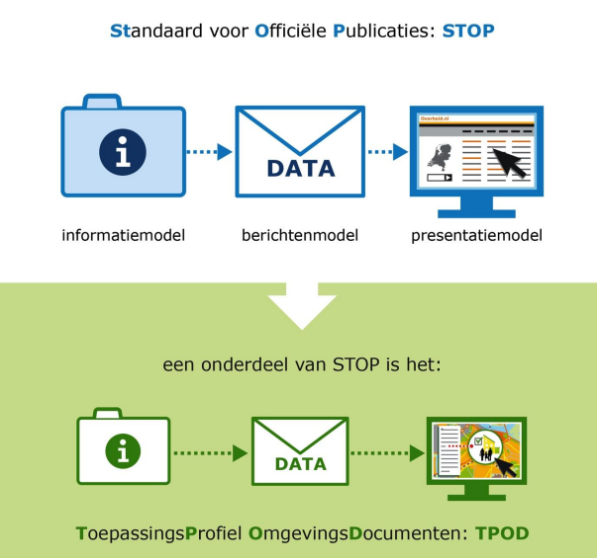
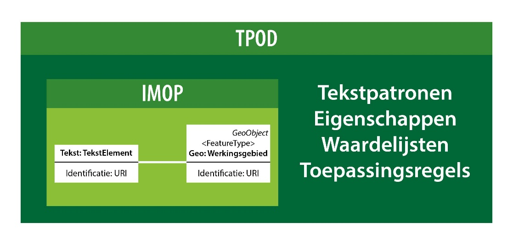

TPOD
----

De TPOD-standaard is hét toepassingsprofiel van de STOP-standaard voor
OW-besluiten in het kader van de Omgevingswet. Deze profielen geven aan welke
gegevens over een besluit moeten worden opgenomen. De profielen geven tevens aan
op welke wijze de inhoud van een document -in digitale vorm- moet worden
samengesteld. Voor elk type OW-besluit bestaat er een specifiek TPOD-profiel.

Relatie STOP en TPOD

De TPOD beschrijft de regels en richtlijnen voor toepassing van het
Informatiemodel voor Officiële Publicaties (IMOP) in het domein van de
Omgevingswet. Het IMOP bevat de generieke, abstracte basis voor de beschrijving
van structuur en inhoud van officiële publicaties in officiële publicatiebladen
van overheden en de daaruit afgeleide consolidaties en het aan die publicaties
gerelateerde berichtenverkeer. De TPOD is een toepassing van IMOP dat weer een
onderdeel is van de Standaard Officiële Publicaties (STOP) en moet begrepen
worden in samenhang met de Berichtenmodel en het Presentatiemodel van STOP.

Link STOP:

<https://standaardenomgevingswet.geonovum.nl/docs/1.%20STOPTP%20v0.97.pdf>

In de TPOD wordt IMOP ingevuld met specifieke eigenschappen en waardelijsten die
gelden voor *alle typen OW-besluiten*. Daarnaast worden algemene onderwerpen,
regels en richtlijnen toegelicht die voor alle OW-besluiten gelden maar niet op
het niveau van IMOP gedefinieerd kunnen worden.

IMOP EN IMTP: TPOD is verbijzondering IMTP

Een TPOD wordt in digitale vorm geleverd in de vorm van een aantal XML-vormige
schema’s (XSD, XSLT, SLD, CSS, GML), waarmee de verplichte elementen bij het
vormgeven van een OW-besluit in digitale vorm worden gedefinieerd.

Relatie IMOP en TPOD

**Er is geen inhoudelijke beschrijving van het Informatiemodel
Toepassingsprofiel (IMTP) opgenomen en het IMTP schema wordt niet meegeleverd in
de 0.97 versie van de Standaarden. Achtergrond: Bij de consultatie van de 0.96
versie is gebleken dat het IMTP mechanisme ingewikkeld gevonden wordt als
centraal onderdeel in het beschrijven van de toepassingsprofielen. De rol van de
middels IMTP beschreven producten, de TP.xml documenten blijkt in de huidige
vorm moeilijk te realiseren.**

Een TPOD wordt bij bevoegd gezag ingeladen in een programma wat een
softwareleverancier heeft geleverd. Hiermee kan onder andere de regeltekst, de
gebiedsgeometrie en annotaties bewerkt, toegevoegd of verwijderd worden. Verder
kan gekozen uit waardenlijsten die behoren bij bijvoorbeeld activiteiten. De
softwareprogrammatuur moet qua functionaliteit op al deze zaken berekend zijn.

Aanvullend is het mogelijk dat de restricties die van een TPOD uitgaan door een
softwarebouwer worden ingebouwd in een applicatie. De ingebouwde/geladen TPOD
zorgt ervoor dat het document, binnen de opmaak/modelleer grenzen die voor het
document gelden, door de gebruiker kan worden opgesteld of kan worden veranderd.
Daarbij geldt altijd volledige beleidsvrijheid voor het bevoegd gezag binnen de
regels die gesteld zijn in de Omgevingswet.

De TPOD beperkt alleen de digitale vorm, waarin gegevens worden vastgelegd. Dit
met als doel dat de gegevens zowel mens-leesbaar als machine-leesbaar zijn.

Verder regelt de standaard de basisvoorwaarden voor het kunnen ontsluiten van
een OW-besluit en het kunnen raadplegen van de regels en de werkingsgebieden die
in dat besluit zijn opgenomen.
