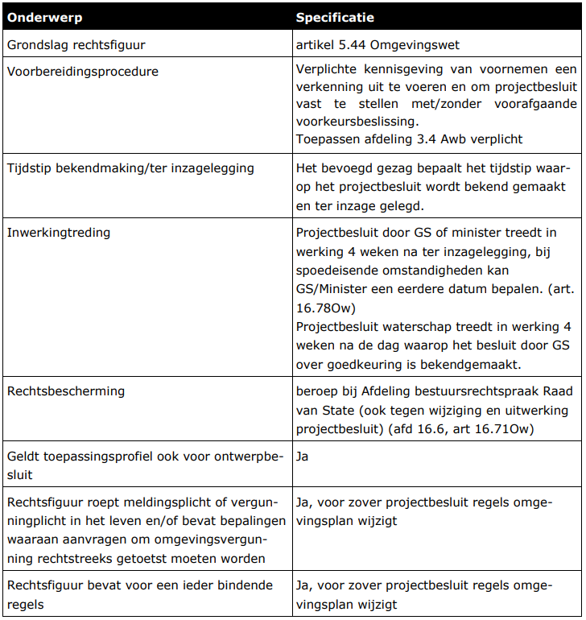

### Kenschets rechtsfiguur projectbesluit

Rijk, provincies en waterschappen kunnen besluiten tot het uitvoeren van een
(vaak) complex project in de fysieke leefomgeving door middel van het
projectbesluit. Het projectbesluit heeft alleen betrekking op projecten waar een
nationaal, provinciaal of waterstaatsbelang mee gemoeid is of indien een privaat
belang samenvalt met een publiek belang, zoals de aanleg van een windpark.

Het projectbesluit is gericht op het uitvoeren van een project en het in werking
hebben of in stand houden daarvan. Voor een aantal categorieën van projecten is
het vaststellen van een projectbesluit verplicht, voor andere projecten van
publiek belang is het mogelijk om een projectbesluit, na toepassing van de
projectprocedure, vast te stellen. Het projectbesluit heeft een bijzonder
karakter. Het bevat de maatregelen en kan alle toestemmingen bevatten die nodig
zijn voor de uitvoering van het project.

Het projectbesluit geldt als omgevingsvergunning voor de expliciet in het
projectbesluit genoemde activiteiten en als toestemming voor andere in het
projectbesluit benoemde activiteiten. Met het oog op de voorbereiding van een
projectbesluit kunnen provinciale staten respectievelijk de minister een
voorbereidingsbesluit nemen.

Zie 3.1 van de [TPOD projectbesluit versie
0.97](https://standaardenomgevingswet.geonovum.nl/docs/14.%20TPOD%20Projectbesluit%20v0.97.pdf)
voor een uitgebreide toelichting op het rechtsfiguur

**Juridische kenmerken projectbesluit**

