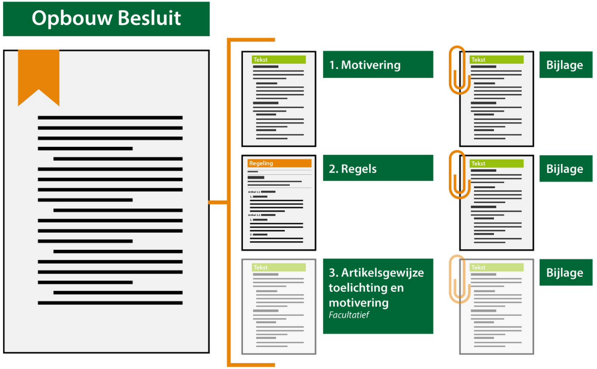

### Toelichting besluitonderdelen

Een besluit bestaat in de meeste gevallen uit drie besluitonderdelen. Deze
sectie geeft een beschrijving van de onderdelen waaruit het besluit bestaat:

-   Deel één: Motivering

-   Deel twee: Regels

-   Deel drie: Artikelsgewijze toelichting

De besluitonderdelen zijn hieronder schematisch weer gegeven.

Schematische weergave besluitonderdelen

*Deel één: Motivering*

Deel één van het besluit bestaat uit de vaststellings- c.q. wijzigingsdocumenten
van het OW-besluit. Dit deel begint met de overwegingen die leiden tot het nemen
van het besluit. Hierin wordt bijvoorbeeld aangegeven op welke onderdelen het
OW-besluit wordt aangepast en wordt verwezen naar, voor die wijzigingen relevant
beleid.

Ter ondersteuning van de motivering kunnen bijlagen met onderzoeksgegevens en
bescheiden bij dit eerste deel van het vaststellingsbesluit gevoegd zijn.

*Deel twee: Regels*

Het tweede deel van het OW-besluit wordt gevormd uit het eigenlijke OW-besluit:
de regels die deel gaan uitmaken van het OW-besluit dan wel de visie- of
beleidstekst, inclusief hun werkingsgebieden. In het geval van een
wijzigingsbesluit wordt in dit deel concreet aangegeven op welke wijze het
OW-besluit wordt aangepast. Aangegeven wordt welke regels, visietekst of
beleidstekst worden toegevoegd, geschrapt, gewijzigd of vervangen door andere.
Dit deel van het vaststellings- of wijzigingsbesluit is vergelijkbaar met de
wijziging van een wet of een verordening. Deel twee kan bijlagen bevatten.

*Deel drie: Artikelsgewijze toelichting (facultatief)*

Het derde deel aan het besluit bevat bij iedere regel van het OW-besluit een
artikelsgewijze toelichting, dit is de volledige artikelsgewijze toelichting.
Dit deel van het vaststellingsbesluit zal dus overeenkomen met de
artikelsgewijze toelichting zoals die bij wetten gebruikelijk is. In dit
onderdeel wordt ook de algemene toelichting van het betreffende OW-besluit
opgenomen. Indien gewenst kunnen bij dit deel bijlagen worden gevoegd.

**Deze indeling geldt niet voor de Omgevingsvisie. Daar is sprake van een
vormvrije tekststructuur en kent geen onderscheid in de drie
besluitonderdelen.**
