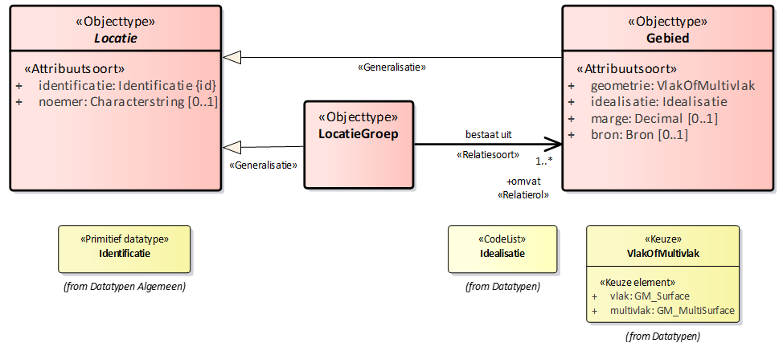

*Eigenschappen van Locatie*

Locatie bevat zoals gezegd één of meer geometrieën. Een geometrie legt een
positie vast door middel van coördinaten. Het gaat hier om de geometrische
beschrijving en niet om een geografische beschrijving in woorden. Voor geometrie
geldt een aantal functionele normen.

De tweede eigenschap van Locatie is Idealisatie. Idealisatie geeft aan hoe
nauwkeurig het bevoegd gezag Locatie heeft bedoeld en hoe Locatie derhalve
geïnterpreteerd moet worden. Een Locatie kan exact bedoeld zijn, maar ook
indicatief. Een voorbeeld van dat laatste is als een grens met een formule
berekend is; de grens houdt dan geen rekening met de situering van objecten als
woningen e.d. terwijl dat in de interpretatie wel zou moeten. Als Locatie
gekoppeld is aan een tekstelement of tekstfragment, kan bij deze koppeling
bijgehouden worden wat de idealisatie van de Locatie is. Aan ieder tekstelement
of tekstfragment dat aan een Locatie is gekoppeld kan dus een eigen idealisatie
toegekend worden. Dat betekent dat eenzelfde Locatie verschillende idealisatie
kan hebben, afhankelijk van welk tekstelement of tekstfragment wordt bevraagd.

Wanneer de Idealisatie indicatief is, kan optioneel worden aangegeven met welke
marge Locatie geïnterpreteerd moet worden. De marge geeft de afstand in meters
voor de interpretatie van de begrenzing aan.

Bij de Locatie wordt de bron bijgehouden. Bron geeft aan of een basisregistratie
is gebruikt om geometrieën uit over te nemen en zo ja welke, dan wel dat een
geometrie berekend of zelf gecreëerd is.

De noemer is een tekstuele beschrijving van de locatie die de verbinding legt
tussen de aanduiding in de tekst van een locatie en de verwijzing naar het
informatie-object in de bijlage bij de regels. Voorbeelden voor omgevingsplan
respectievelijk omgevingsverordening, waarbij de noemer in cursieve tekst is
weergegeven, zijn:

-   Ter plaatse van de functie *Levendig stadscentrum* zijn de volgende
    activiteiten toegestaan.

-   Nieuwe luidruchtige activiteiten en gedragingen zijn in een *stiltegebied*
    verboden.

| Geometrie | De beschrijving van de positie door middel van coördinaten.                                                      |
|           | Voor Geometrie gelden de volgende functionele normen:                                                            |
|-----------|------------------------------------------------------------------------------------------------------------------|

    -   Bij Locatie is Geometrie verplicht.

        -   Locatie kan bestaan uit één of meer Geometrieën.

            -   Een Geometrie mag alleen een vlak of multivlak zijn.

            -   Per Locatie kan de coordinate reference system (crs)
                verschillen. Deze wordt bijgehouden bij Geometrie. Als een
                Locatie bestaat uit meerdere Geometrieën moeten deze allemaal
                dezelfde crs hebben. De standaard ondersteunt de volgende
                crs-en:

                EPSG:28992 (=RD) en EPSG:4258 (=ETRS89)

| Bron        | De bron die is gebruikt voor, dan wel de wijze van inwinning van de geometrie. Bron wordt gekozen uit een limitatieve waardelijst.                                                                                                                                                          |   |   |   |   |   |
|-------------|---------------------------------------------------------------------------------------------------------------------------------------------------------------------------------------------------------------------------------------------------------------------------------------------|---|---|---|---|---|
| Idealisatie | De manier waarop de begrenzing van Locatie geïnterpreteerd moet worden en door het bevoegd gezag bedoeld is. Idealisatie wordt gekozen uit een limitatieve waardelijst.                                                                                                                     |   |   |   |   |   |
| Marge       | De afstand in meters waarmee de indicatief bedoelde begrenzing van Locatie geïnterpreteerd moet worden. Marge is een optionele eigenschap die alleen kan worden gebruikt wanneer de waarde van Idealisatie indicatief is. De marge is de afstand in meters en wordt aangegeven met decimal. |   |   |   |   |   |
| Noemer      | De tekstuele beschrijving van de locatie.                                                                                                                                                                                                                                                   |   |   |   |   |   |

Eigenschappen van locatie toegelicht

Dat ziet er in de STOP dan als volgt uit:

