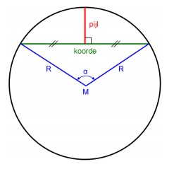

*Cirkelbogen*

Cirkelbogen (of delen daarvan) komen in de juridische wet- en regelgeving op
meerdere plekken voor. Voorbeelden zijn de brandaandachtsgebied,
gifwolkaandachtsgebied, maar ook voorbeelden waarbij bijvoorbeeld bouwen niet
toegestaan is in een gebied van X meter rondom een object (boom, monument enz).
In de praktijk formuleert de jurist vaak in gebied of/en gebied om een object en
daarmee wordt deze wiskundig/meetkundig gemodelleerd naar een omhullende met een
straal ten opzichte van de buitenzijde van een object. Wordt het object als een
punt gezien, dan ontstaat een cirkel. Wordt het object als een polygoon (qua
geometrie) weergegeven ontstaat een omhullende waarin delen van een cirkelboog
kunnen voorkomen.

Bij de implementatie in het DSO-stelsel is de verwerking van exacte cirkelbogen
bewerkelijk en complex. Om die reden wordt veelal een benadering van de
juridisch geldende kromme gebruikt door deze te modelleren als een serie
lijnstukken die allen op de cirkelboog liggen: ofwel verstroken. Naar keuze
kunnen deze onderling verbonden zijn met rechte lijnstukken van punt naar punt
(de inwendige benadering) dan wel het midden vormen van de lijnstukken die deels
inwendig en deel uitwendig ten opzichte van de cirkelboog liggen. Deze laatste
manier van verstroken van de cirkelboog heeft een zeer kleine afwijking van de
juridische geldende boog.

Voorgesteld wordt om het verstroken van cirkelbogen in de implementatie te
kiezen boven een complexe kosten intensieve meetkundig geheel juiste toepassing.
De kosten overtreffen het beoogde doel binnen het DSO stelsel. Voor juristen
geldt de wiskundige beschrijving ongeacht de presentatie daarvan.

De methode van verstroken is eerder door Geonovum in samenwerking met het
kadaster en andere organisaties in het geo-werkveld beschreven. We verwijzen dan
ook naar deze methode. Aandachtpunt is dat Geo-applicatie programmatuur de wijze
van verstroken zoals aangeduid niet altijd juist toepassen. Dit laatste kan door
het aanbieden van een validator m.b.t. deze functionaliteit mogelijk worden
ondervangen. In de BGT opbouw wordt al als zodanig gebruikt.

Om te voorkomen dat cirkelbogen te gedetailleerd verstrookt worden en er heel
veel plaatsbepalingspunten ontstaan, beschrijft deze praktijkrichtlijn een
aanbevolen tolerantiewaarde voor het verstroken van cirkelbogen. Algemeen
cirkelbogen Een koorde is het lijnstuk dat twee punten op een cirkel met elkaar
verbindt. De pijl is het lijnstuk tussen het midden van een (cirkel)boog en het
midden van de koorde op die boog. De pijl staat loodrecht in het midden op de
koorde. Verstroken en tolerantiewaarde Een cirkelboog wordt opgedeeld in rechte
lijnstukken tussen de coördinaten van de cirkelboog tot dat de pijl minder is
dan een bepaalde tolerantiewaarde.

De aanbevolen tolerantiewaarde voor het verstroken van cirkelbogen in de
geometrie van BGT/IMGeo objecten is 0.05m, ofwel 5 centimeter. Er bestaan
verschillende technische algoritmen voor het verstroken van cirkelbogen. Deze
praktijkrichtlijn laat leveranciers c.q. bronhouder de keuze welke
verstrokingsalgoritme wordt toegepast.

Een koorde is het lijnstuk dat twee punten op een cirkel met elkaar verbindt. De
pijl is het lijnstuk tussen het midden van een (cirkel)boog en het midden van de
koorde op die boog. De pijl staat loodrecht in het midden op de koorde.
