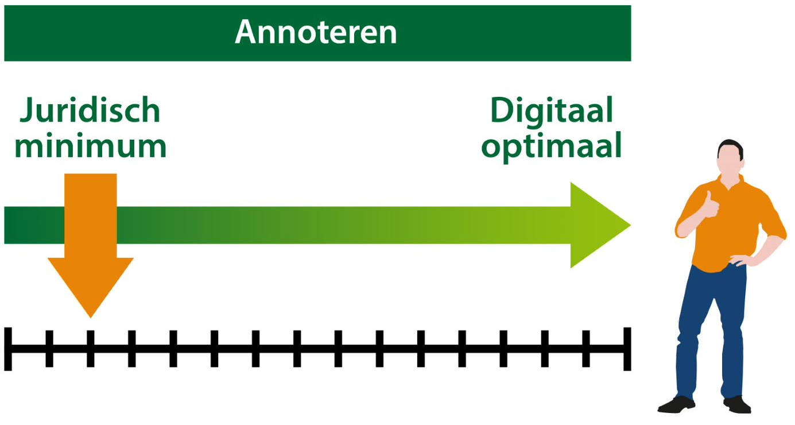

### Voor en nadelen van annoteren 

In de afbeelding hieronder is te zien dat er een juridisch minimum is aan zaken
die geannoteerd moeten worden. Daarnaast kan het bevoegd gezag schuiven tot er
digitaal optimaal mee gewerkt kan worden. Ieder bevoegd gezag kan zelf bepalen
wanneer het digitaal optimaal is. Dit hangt af van het ambitieniveau, de
beschikbare capaciteit voor het opstellen van het OW-besluit en de beschikbare
capaciteit voor het beheer.

*Annotatie-schaal van juridisch minimum tot digitaal optimaal*

**Voordelen van veel annoteren zijn:**

-   Het kunnen verwerken en doorleveren van OW-besluiten op de LVBB

-   Het machine-leesbaar maken van tekst en werkingsgebieden

-   Een goede betekenisvolle weergave van zowel regeltekst als de kaart

-   Hiermee wordt de verbondenheid tussen regels en werkingsgebied groter.

-   Garanderen dat het basisniveau van DSO-LV werkelijk benut kan worden:

-   Zoeken

-   Verwijzen

-   Selecteren

-   Relateren

-   Het vergroten van de vindbaarheid van delen in de tekst

-   Meer keuzemogelijkheden voor bevoegd gezag

-   Meer ruimte voor maatwerk en afstemming op concrete informatiebehoeften van
    de gebruikers

**Nadelen van veel annoteren zijn:**

-   Extra werk voor het betreffende bevoegde gezag

-   Men weet niet of alle functionaliteit in DSO-LV benut wordt

-   Minder uniforme ontsluiting van OW-besluiten op DSO-LV

Het is dus een afweging die per bevoegd gezag gemaakt dient te worden in
combinatie met een zekere mate van verplichting van annoteren in de standaarden.
Het opgeven van Bekendmakingswet-annotaties is het juridisch minimum. In de
volgende sectie worden de annotatiesoorten en hun werking besproken.
