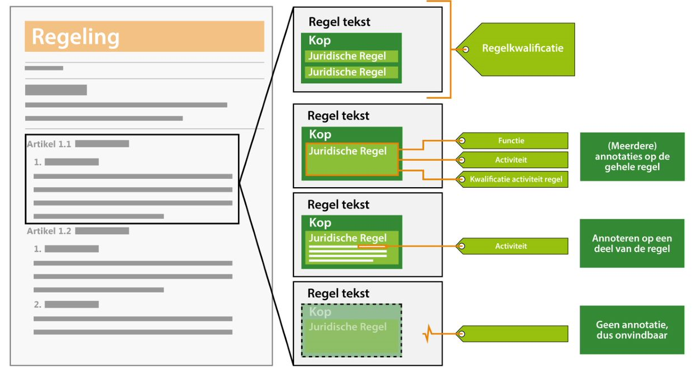
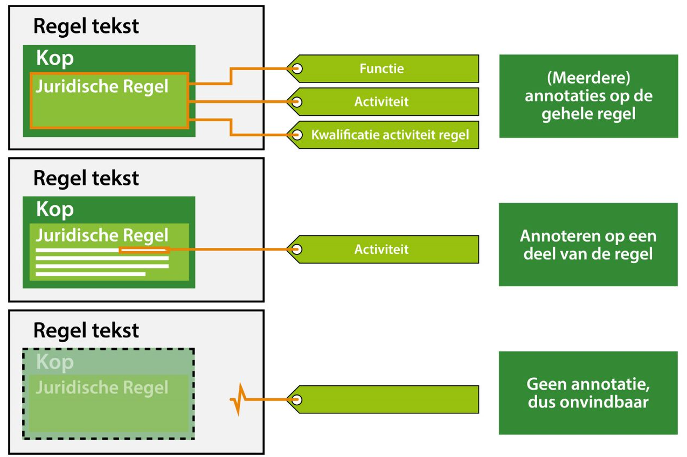

*Toepassen van annoteren*

In het IMOP is vastgelegd welke mogelijkheden er zijn met betrekking tot
annoteren. In de TPOD is vervolgens gespecificeerd van welke annotatie
mogelijkheden er gebruik gemaakt kan of moet worden. In onderstaande tabel is
voor de omgevingswet- en services annotaties uitgewerkt welke van toepassing
zijn in welke OW-besluiten. Een kleine leeswijzer:

Groen=Van toepassing

Rood=Niet van toepassing

Oranje=Er wordt aan gewerkt om deze annotatie gereed te krijgen in de
standaarden 0.98

*Annotatiemogelijkheden per OW-besluit*

In de TPOD van het specifieke OW-besluit is in elk hoofdstuk 5.6 nader
uitgewerkt wat deze annotaties omvatten. Het is niet de bedoeling om in deze
praktijkrichtlijn volledig alle annotaties uit te werken, maar om meer
uitwerking te geven aan hoe die annotaties in de praktijk gaan werken.

*Vormen van annoteren*

In paragraaf 3.2.1 van de praktijkrichtlijn is uitgelegd hoe regelteksten zich
verhouden tot de regeling, juridische regels, structuurelementen en welke
tekststructuur zij kunnen bevatten. Naast deze structuren, bevatten regelteksten
ook annotaties.

Een juridische regel kun je annoteren op een activiteitregelkwalificatie,
activiteit en/of functie, maar ook delen van zinnen of woorden kunnen annotaties
bevatten. Wordt de juridische regel niet geannoteerd dan is deze als regel ook
niet vindbaar of gekwalificeerd. Zie onderstaande figuren voor een schematische
weergave.

*Annoteren regeltekst*

Eén van de annotaties is de regelkwalificatie, die aangeeft of de regel
bijvoorbeeld een vergunningsplicht of meldingsplicht betreft. Deze wordt altijd
aan het niveau van de regeltekst geannoteerd. Met andere woorden, deze zit nooit
als annotatie vast aan één woord. Zie het figuur hieronder voor de schematische
weergave.

*Annoteren regelkwalificatie*

In elke TPOD van de afzonderlijke OW-besluiten is aangegeven of de annotaties in
het OW-besluit kunnen voorkomen. Daarnaast is aangegeven welke regels er gelden
voor het gebruik van de annotatie.
