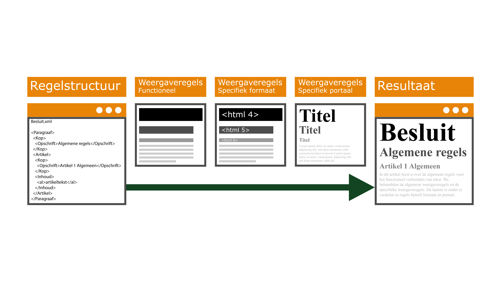

### Presentatieregels bij regelingstructuur 

Bij regelteksten is de artikelsgewijze opbouw kenmerkend. Functionele
presentatieregels volgen de volgorde die voorgeschreven wordt door de Aanwijzing
voor de regelgeving. Hierin wordt de volgorde van groot naar klein vastgelegd en
hebben de tekstonderdelen een relatieve grootte ten opzichte van elkaar. Deze
presentatieregels zijn onderdeel van de landelijke standaard en het juridische
spoor. In de afbeelding hiernaast is weergegeven hoe dat eruit ziet. In de
afbeelding hieronder is in het tweede blok van links een conceptuele weergave
gemaakt van hoe de functionele presentatieregels eruitzien.

Functionele weergave regels

Vertaling machine-leesbare tekst naar mensleesbare gestructureerde tekst

De functionele presentatieregels moeten worden vertaald naar regels die voor het
gebruikte medium bruikbaar zijn. Hiervoor is er een tweede set presentatieregels
voor specifieke formaten ontwikkelt. Zie het middelste blok in bovenstaande
afbeelding. Te denken valt aan een set regels voor html-formaten en een set
regels voor PDF/A-formaat.

Hierbij moet nog extra opgemerkt worden dat dit gemaakt is voor een digitale
weergave. Analoog verbeelden geen onderdeel van de standaard uitmaakt en hooguit
een optie is, maar geen verplichting.

De derde set regels, presentatieregels specifieke uitgave/portaal, zal onderdeel
zijn van de specifieke uitgave zelf. Denk hierbij aan het CSS-opmaakbestand van
een gemeentelijke site. Deze zal anders zijn dan het CSS-opmaakbestand binnen
een website als Overheid.nl. Het staat eenieder vrij om een eigen specifieke
uitgave te maken en hierbij een volledig andere weergave te maken.

In het tweede blok van rechts is conceptueel weergegeven hoe deze
presentatieregels eruitzien.

Een sprekend voorbeeld is de Omgevingsvisie die ook in de communicatie met het
grote publiek een belangrijke rol speelt. De mogelijkheid om functionele regels
via verschillende mediums te publiceren biedt de bestuursorganen de
flexibiliteit om het instrument zoveel mogelijk naar eigen inzicht vorm te
geven.
