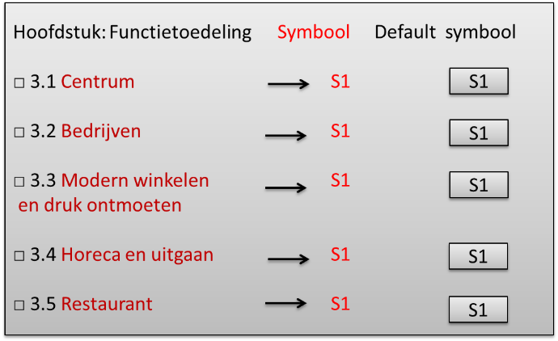

### Een default symbool

Zonder gespecificeerde presentatie kan een viewer de gebieden met een default
symbool weergeven. Zo zullen alle functies op de kaart in het onderstaande
voorbeeld grijs getoond worden. Wanneer er gebieden zonder kenmerken zijn, zal
dit de enige methode zijn.

*Een voorbeeld van een default symbool voor functies uit een Omgevingsplan*
