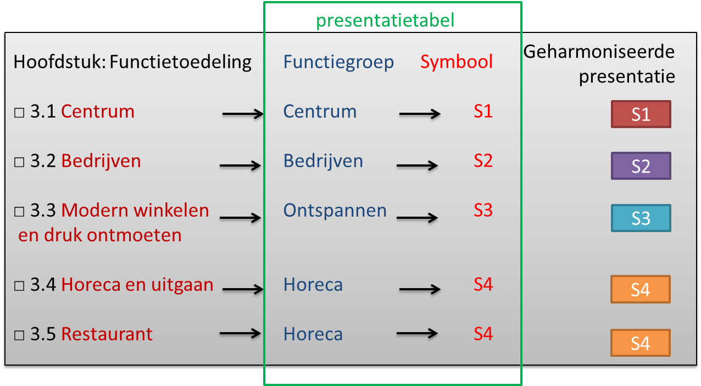

### Een standaard symbool

Het hanteren van een standaard symbolisatie biedt vooral mogelijkheden om
geüniformeerde weergave te genereren, bijvoorbeeld voor een landelijk overzicht
of tussen verschillende besluiten binnen de eigen instrumenten. Het biedt ook
voordelen voor eenvoud in beheer en het komt de leesbaarheid van de kaart ten
goede. In het onderstaande voorbeeld is gebruik gemaakt van de standaard
semantiek binnen ‘functiegroep’ om tot een standaard legenda te komen.

*Een voorbeeld van een standaard symbool voor functies uit een Omgevingsplan*
