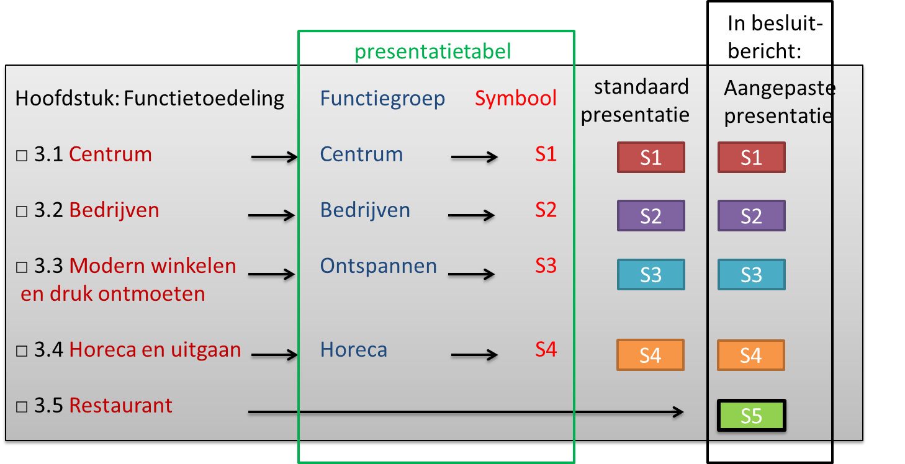

### Een afwijkend symbool

Wanneer er behoefte is om een afwijkend symbool te kiezen, kan er op basis van
een ander kenmerk worden gepresenteerd. In dit geval de functienaam; dit betreft
geen standaard semantiek en kent een ongelimiteerd aantal varianten.

In het voorbeeld hebben twee functies identieke symbolen gekregen, omdat ze tot
dezelfde semantische groep behoren. Om toch onderscheid te hebben, wordt voor
Restaurant afgeweken van de standaard. Voor de presentatie van Restaurant stuurt
de bronhouder in dit geval het symbool kenmerk mee.

*Een voorbeeld van een standaard symbool met afwijkend eigen symbool voor
functies uit een Omgevingsplan*
