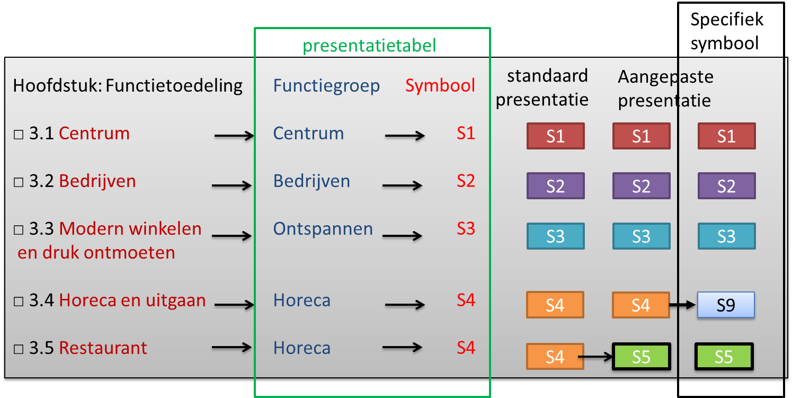

### Een specifiek symbool

Binnen een besluit kunnen meerdere
[kaartviewers](../../../../Users/Mderee/Downloads/20190114%20Werkdocument%20H%204%20Praktijkrichtlijnen%20v%200.97consGVP.docx#_Kaartillustraties)
worden geplaatst om de inhoud van de werkingsgebieden kenbaar te maken. Soms is
er de wens om eenzelfde object in een specifieke kaart een ander symbool te
geven. In dat geval kan dit worden aangegeven bij de specifieke kaartopbouw. In
het onderstaande voorbeeld is voor een specifieke kaartviewer het symbool voor
Horeca en uitgaan blauw gemaakt.

*Een voorbeeld van een standaard symbool met specifiek symbool binnen een
kaartviewer voor functies uit een Omgevingsplan*
