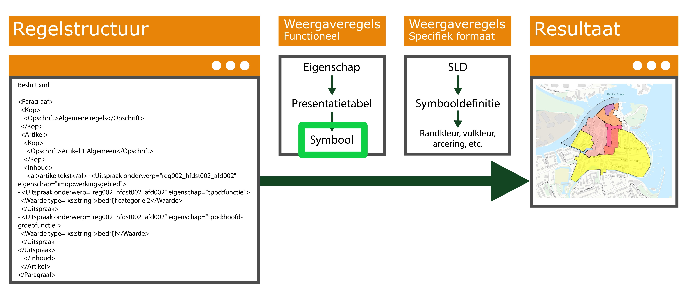

Symboolkenmerk
--------------

De weergave wordt via de symbolisatie vastgelegd in een symboolkenmerk
‘*Symbool’*. Feitelijk is een Symbool met een symboolcode een eigenschap bij een
annotatie.

De weergave wordt vastgelegd in een symboolkenmerk ‘Symbool’

Voor technische informatie over de systematiek van de symbolisatie wordt
verwezen naar: *Documentatie STOP TP v0.97 Module symbolisatie.*

Bij OW-besluiten zijn een aantal annotaties (en hun eigenschappen) waarvoor
presentatie van werkingsbieden op een kaartbeeld van toepassing is: de
presentatie-entiteiten. Dit zijn de presentatie-entiteiten:

-   Activiteitengroep

-   Beperkingengebiedgroep

-   Functiegroep

-   Omgevingsnormgroep

-   Omgevingswaardegroep

-   Onderwerpgroep

Voor deze annotaties is Symbolisatie van toepassing; een symbolisatiemethode
wordt gebruikt om in het kaartbeeld het werkingsgebied in een bepaalde stijl
weer te kunnen weergeven. De annotatie-eigenschap symboolcode kan voor
presentatie vergeleken worden met een waarde uit de symbolenbibliotheek en de
bijbehorende stijl wordt gebruikt bij het visualiseren.

In de bijlagen van het presentatiemodel zijn afbeeldingen van de
Symbolisatietabellen presentatie-entiteiten_STOP_v0.97 opgenomen.
