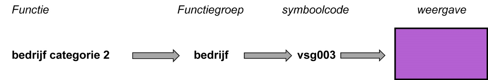
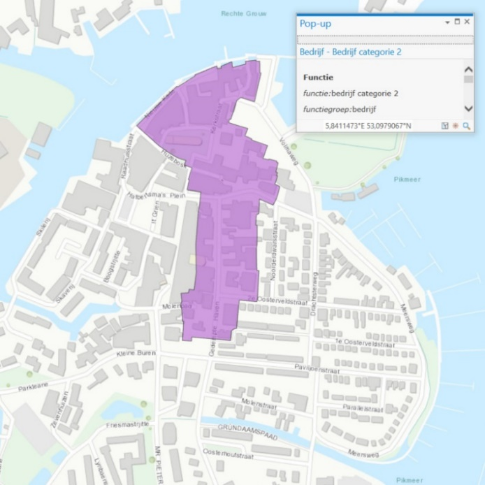

### Voorbeeld hoe annotaties zorgen voor de presentatie op het kaartbeeld

Deze paragraaf laat door middel van voorbeeld zien hoe de annotaties zorgen voor
de weergave op het kaartbeeld. Het principe is generiek, hier wordt een
voorbeeld beschreven voor een Functie in een omgevingsverordening.

In de omgevingsverordening kunnen met het oog op een evenwichtige toedeling van
functies aan locaties regels worden gesteld over activiteiten die gevolgen
(kunnen) hebben voor de fysieke leefomgeving. Dit abstracte criterium kan
concreet worden toegepast door het gebied waar een functie van toepassing is met
coördinaten te begrenzen en de annotatie *Functie* toe te voegen.

De annotatie Functie kent een aantal eigenschappen. De eigenschap *Functiegroep*
zorgt er voor dat de werkingsgebieden van een bepaalde groep functies worden
weergegeven op een kaartbeeld. Functiegroep kan worden gekozen uit een
limitatieve waardelijst.

Een voorbeeld van een functie is *Bedrijf categorie 2*. De functie Bedrijf
categorie 2 behoort tot de Functiegroep Bedrijf, één van de waarden van de
waardelijst Functiegroep. Wanneer regels over de functie Bedrijf categorie 2
worden geannoteerd met de Functiegroep Bedrijf zorgt de symboolcode van deze
Functiegroep voor weergave met een paarse kleur zoals weer gegeven in
onderstaand voorbeeld.

Voorbeeldweergave Functiegroep

Door deze methodiek worden de werkingsgebieden van functies die behoren tot de
Functiegroep Bedrijf door middel van de annotatie-eigenschap Functiegroep en de
waarde Bedrijf met een paars vlak op het kaartbeeld weergegeven, zie
onderstaande afbeelding.

Voorbeeld presentatie Functie Bedrijf categorie 2 op kaartbeeld d.m.v.
annotatie-eigenschap Functiegroep en waarde Bedrijf

De veelheid van domeinen die in de fysieke leefomgeving samenkomen in één of
meerdere omgevingsbesluiten in een gebied, leidt ertoe dat ondanks de
zorgvuldigheid van de standaard om éénduidig te zijn, er een combinatie van
symbolen ontstaat die net geen goed leesbaar beeld oplevert. In dat geval kan de
maker zelf een ander symbool toewijzen aan de entiteit die hij/zij wil tonen.
Dit afwijkend symboolgebruik wordt onthouden en doorgegeven aan de LVBB om te
gebruiken bij bekendmaken. Juridisch wordt immers onveranderlijkheid van het
besluit gevraagd.

Daarnaast geeft deze methodiek de mogelijkheid om in een viewer zelf lagen of
selecties te activeren voor een optimaal beeld voor een vraag. **Dit is
onderdeel van het servicespoor.**
