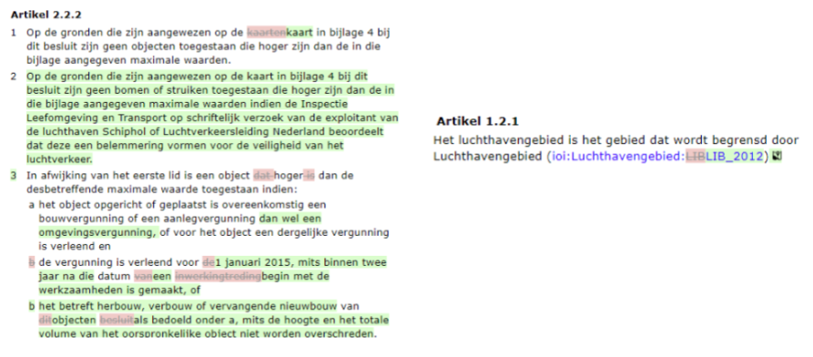

Weergeven van verschillen
-------------------------

Het presentatiemodel regelt de juridisch gevraagde weergave van de inhoud van
het genomen wijzigingsbesluit. Dit wordt gedaan door het verschil tussen de
toestand voor en na de wijziging te tonen, een zogenaamde was-wordt. Daarnaast
is het verplicht om het verschil te visualiseren. Het bevoegd gezag neemt immers
het besluit over de verandering. De functionaliteit voor de verschilweergave
wordt met het presentatiemodel voorgeschreven. Het gaat zowel om de presentatie
van (regel)tekst als de werkingsgebieden.

Voorbeeld: verschilweergave (regel)tekst

Ook bij de verschilweergave wordt de systematiek van [functioneel
presenteren](../../../../Users/Mderee/Downloads/20190114%20Werkdocument%20H%204%20Praktijkrichtlijnen%20v%200.97consGVP.docx#_Principe_voor_de)
gehanteerd: het presentatiemodel schrijft voor dat het wijzigingsbesluit de oude
en de nieuwe versie inzichtelijk moet maken door ze gecombineerd te presenteren
en dat ook de verschillen visueel moeten worden geduid. De symboliek (kleuren,
font, grootte, arcering etc.) worden echter in stylesheets buiten het besluit
gedefinieerd. In bovenstaand voorbeeld wordt de tekst die niet wijzigt, in de
renvooiweergave, zonder markering weergegeven. De tekst uit de oude versie wordt
rood gemarkeerd en doorgehaald. De nieuwe tekst wordt eraan toegevoegd en groen
gemarkeerd.

Aan de formulering van een wijzigingsartikel dient toegevoegd te worden hoe de
wijzigingen worden gepresenteerd, bijvoorbeeld:

De formulering van een wijzigingsartikel luidt bijvoorbeeld als volgt:

*Het omgevingsplan wordt gewijzigd zoals in bijlage A is aangegeven.*

*De teksten die wijzigingen worden rood gemarkeerd en doorgehaald weergegeven.
De nieuwe tekst wordt groen gemarkeerd.*

In bijlage A wordt de tekst van de onderdelen die wijzigen in de
renvooiweergave, zoals in het wijzigingsartikel is beschreven, gepresenteerd.

In bijlage A wordt de tekst van de onderdelen die wijzigen in de
renvooiweergave, zoals in het wijzigingsartikel is beschreven, gepresenteerd.

Conceptuele weergave van een wijzigingsbesluit

De verschilweergave wordt ook gebruikt om wijzigingen van geo-informatieobjecten
kenbaar te maken. Ook de systematiek van [functioneel
presenteren](../../../../Users/Mderee/Downloads/20190114%20Werkdocument%20H%204%20Praktijkrichtlijnen%20v%200.97consGVP.docx#_Principe_voor_de_1)
wordt gehanteerd: het presentatiemodel schrijft voor dat het wijzigingsbesluit
de oude en de nieuwe versie inzichtelijk moet maken door ze gecombineerd te
presenteren en dat ook de verschillen visueel moeten worden geduid.
