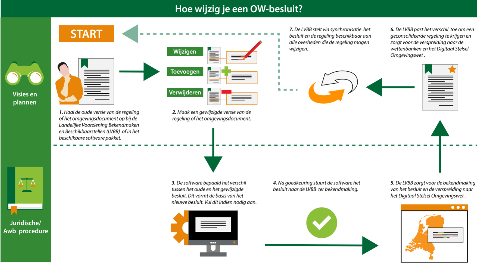

### De stappen voor het wijzigen van een besluit

Het wijzigen van een OW-besluit begint bij het vinden van het geldende besluit.
Deze staat in ieder geval op de LVBB als juridische waarheid, maar kan ook in de
software worden opgeslagen. Je kunt deze met een nieuwe versie aanmaken en
bewerken.

Weergave hoe daadwerkelijk een OW-besluit gewijzigd wordt binnen de Omgevingswet

Bevoegd gezag maakt op basis van een eerder bekendgemaakte versie een nieuwe
versie waarin de beoogde wijzigingen zijn aangebracht. Betreft het een nieuwe
regeling, dan maken medewerkers de initiële versie. Dit is het startpunt in de
afbeelding hierboven.

Een nieuwe versie van het besluit is nodig om later te kunnen tijdreizen en aan
te wijzen welke besluiten zijn genomen in een bepaalde versie. De laatste versie
wordt in de eerste instantie bewerkt tot een nieuwe geconsolideerde versie.

Het bevoegd gezag moet een formeel besluit nemen over de wijziging. De
beschrijving van de wijzigingen wordt door software bepaald; de medewerkers
vullen dat aan met bijvoorbeeld een motivatie voor het wijzigen van de regeling.

Na goedkeuring zal het besluit ter bekendmaking aan de LVBB worden verstuurd.
Onderdeel van het bericht is de mutatie zoals door IMOP wordt beschreven.
