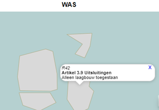
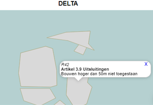
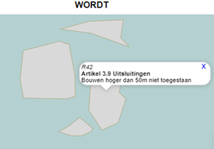
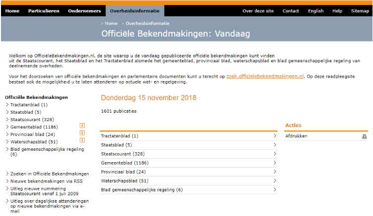
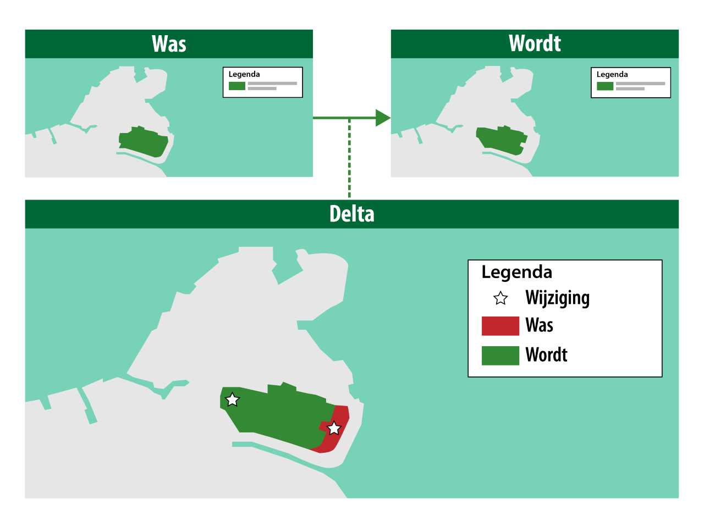

Was-wordt berichten
-------------------

De mutaties aan artikel 2 worden vervolgens meegenomen als een WAS-WORDT-bericht
naar de Landelijke voorziening Bekendmaken en Beschikbaar stellen (LVBB). De was
is het huidige besluit en de wordt is het nieuwe besluit. Het verschil hier is
de zogenoemde delta. Er gaat een bericht uit gestuurd naar de (LVBB) dat artikel
2 gewijzigd is. Vervolgens worden deze wijzigingen goedgekeurd en het oude
artikel 2 verdwijnt uit het geconsolideerde plan en de gewijzigde versie wordt
daarin geschoven.

Was: Auto's mogen maximaal 2 uur parkeren in vakken die blauw omlijnd zijn.

Verschil: Groen gemarkeerde tekst

Wordt: Auto's en motoren mogen maximaal 2 uur parkeren in vakken die blauw
omlijnd zijn en 4 uur in vakken die groen omlijnd zijn.

Mutaties van regels, werkingsgebieden en annotaties worden via
WAS-WORDT-mutaties (ook al bekend in de wereld van de BGT) aangeleverd en in de
LVBB geconsolideerd.

*Een WAS-WORDT-mutatie beschrijft de wijziging van de ene naar de andere versie
van de regeling.*

Elke wijzigbare component (ofwel: tekst, informatieobject, annotatie) bestaat
uit individueel adresseerbare objecten. De mutatie geeft aan:

-   Toe te voegen objecten;

-   Nieuwe waarden voor gewijzigde objecten;

-   Welke objecten verwijderd worden.

Alleen voor de juridische componenten (tekst, informatieobjecten) ook voor de
gewijzigde objecten:

-   Verschil voor zover nodig voor weergave

**Was**

Huidige werkingsgebieden en regel Artikel 3.9

Uitsluitingen: Alleen laagbouw toegestaan

**Verschil/delta**

splitsen werkingsgebieden en wijziging regel Artikel 3.9

Uitsluitingen: Bouwen hoger dan 50 m niet toegestaan

**Wordt**

1 werkingsgebied aangepast en 1 werkingsgebied verwijderd en gewijzigd Artikel
3.9 Uitsluitingen: Bouwen hoger dan 50 m is niet toegestaan.

Het borgen van juridische onveranderlijkheid vereist dat de aangeleverde
WAS-WORDT-mutaties volgens dezelfde principes zijn gemaakt als de principes die
gebruikt worden om ze te verwerken in de LVBB.

*Voor een bevoegd gezag is de stapeling van besluiten de regeling, en zijn de
uitgeschreven versies na een wijziging een serviceproduct voor de gebruiker*.

Samenvattend wordt er eerst een nieuwe versie van een reeds geconsolideerde
regeling opgesteld. Er wordt door bevoegd gezag bepaald welke wijzigingen er
hebben plaatsgevonden middels een wijzigingsartikel. Ook worden meteen de
verschilweergaven van de bijlagen vastgelegd. Daarna wordt een besluit
vastgesteld bij het bevoegd gezag. Hierna wordt het besluit bekendgemaakt. Dit
gebeurt nog steeds via de reeds bekende Officiële Bekendmakingen.

Website Officiële Bekendmakingen

Dan kan het omgevingsbesluit gepubliceerd worden met behulp van
WAS-WORDT-mutaties en een bijgevoegd bericht op de LVBB. Als het bericht
goedgekeurd wordt door het digitale loket dan wordt het nieuwe omgevingsbesluit
geconsolideerd met de voorgaande versie. Hiermee wordt meteen de
onveranderlijkheid en beschikbaarheid geborgd van het besluit en de bijgevoegde
informatieobjecten.

Ook voor werkingsgebieden geldt een was-wordt variant, zoals eerder ook al
beschreven bij stappen voor het wijzigen van een werkingsgebied van een
OW-besluit.

Was-wordt voor werkingsgebieden (geo-informatieobjecten)
