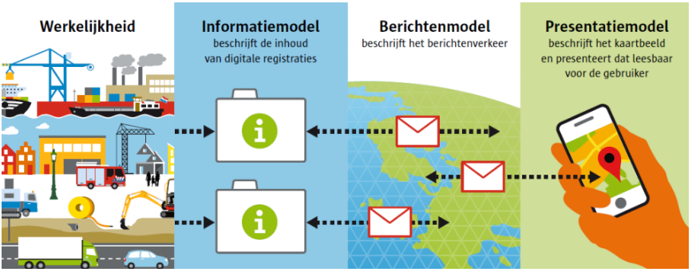

Berichtenverkeer tussen de bronhouder en de LVBB
------------------------------------------------

In het Informatiemodel vindt de gebruiker *wat* er wordt uitgewisseld.

In het Berichtenmodel vindt de gebruiker *hoe* er wordt uitgewisseld

Via het Presentatiemodel wordt een kaartbeeld, duidelijk *leesbaar* voor de
eindgebruiker, getoond.

Praktisch betekent dit dat uitwisselen van automatisch berichtenverkeer loopt
via het systeem van de bronhouder welke koppelt met systeem van de LVBB. Er is
geen handmatige upload of download van berichten of leveringen. Mogelijk komt er
een uploadportaal. Er wordt gewerkt via het clean order principe. Dat betekent
dat in een bericht een duidelijke opdracht voor verwerking meegegeven wordt.
