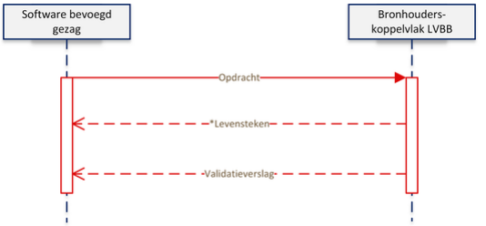

### Validatie OW-besluit

Aangesloten software kan een opdracht tot validatie van een officiële publicatie
(besluit, kennisgeving of mededeling) opsturen. De interactie volgt het patroon:
De opdracht voor validatie bevat dezelfde informatie als de opdracht voor
publicatie, op de naam van de service na. Daarnaast bevat de opdracht de
officiële publicatie volgens STOP standaard.

De validatie is functioneel gelijk aan de validatie die uitgevoerd wordt als
eerste stap van de publicatieservice en gaat na dat de situatie correct is die
ontstaat na bekendmaking of publicatie:

>   1. De opdracht wordt aangeleverd door software van een organisatie die
>   daartoe gerechtigd is, conform de aansluitvoorwaarden van de LVBB.

>   2. De opdracht is (technisch) correct geformuleerd en kan door de LVBB
>   uitgevoerd worden.

>   3. De officiële publicatie is correct geformuleerd conform de STOP standaard
>   en het toepassingsprofiel voor de publicatie.

4. Voor een besluit:

>   a. De informatie die de resulterende geconsolideerde regelingen beschrijft
>   is toepasbaar. Dit valt in drie delen uiteen:

>   i. De resulterende versies/toestanden van een regeling zijn in te passen in
>   de regeling (= te combineren met eerder bekendgemaakte toestanden voor de
>   regeling).

>   ii. De objecten om de toestanden mee op te bouwen zijn inpasbaar (= te
>   combineren met de objecten uit eerder bekendgemaakte toestanden).

>   iiiDe objecten zijn correct geformuleerd en geschikt voor gebruik in de
>   regeling (conform de STOP standaard en het betreffende toepassingsprofiel).

>   b. De resulterende versies (toestanden) van de geconsolideerde regeling(en)
>   zijn correct (conform de STOP standaard en het betreffende
>   toepassingsprofiel).

>   5. De resulterende versies (toestanden) van de geconsolideerde regeling(en)
>   zijn correct (conform de STOP-standaard en het betreffende
>   toepassingsprofiel).

**Bij de validatie wordt zoveel mogelijk informatie gevalideerd. De validatie
stopt pas als het niet meer mogelijk of zinvol is om een volgende stap te
zetten.**

De uitkomst van de validatie van een besluit is in principe afhankelijk van het
moment dat de validatie wordt uitgevoerd, omdat bij het samenstellen van de
resulterende geconsolideerde regeling rekening gehouden moet worden met eerder
bekendgemaakte besluiten en andere mutaties van de geconsolideerde regeling.
